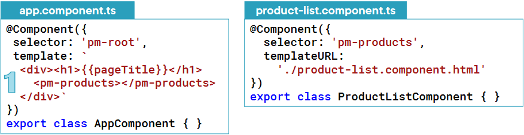
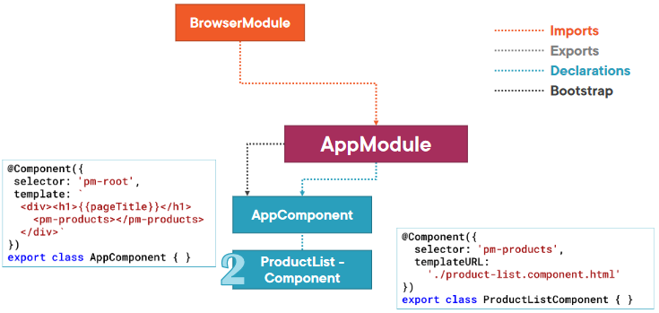
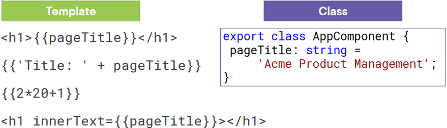
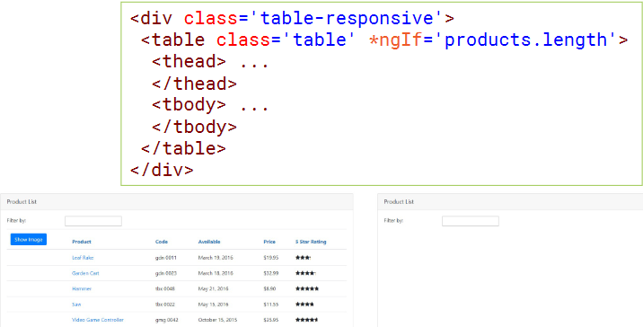
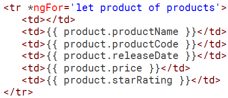
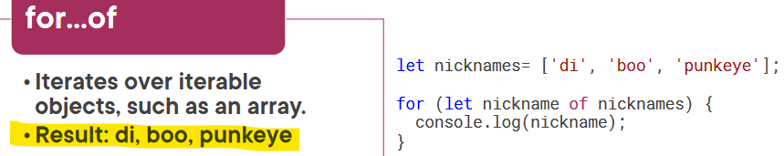
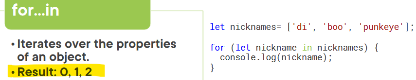

# angular basics в картинках

## Component as Directive

## Component as Directive

## Interpolation

## Angular Built-in Directives

## \*ngIf Built-In Directive

## \*ngFor Built-In Directive

## for…of vs for…in

## for…in (i→in→index)

