# angular basics в картинках

## Property Binding

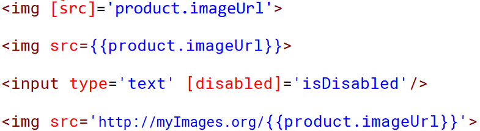

## Property Binding

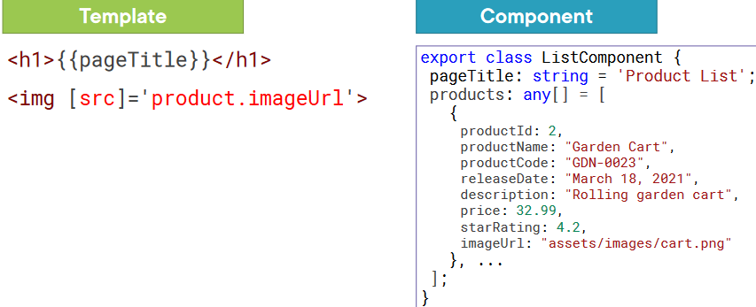

## Event Binding

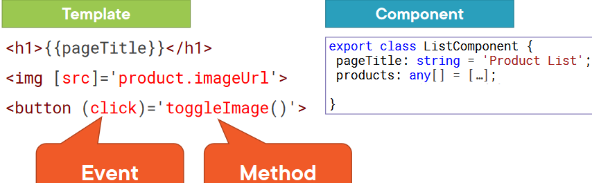

## Change Detection

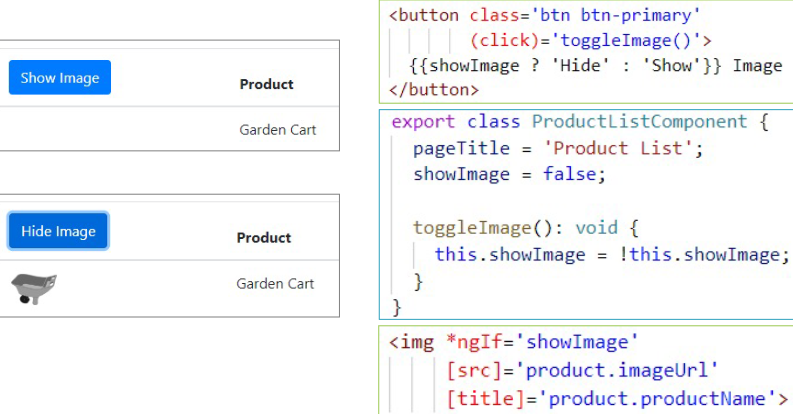

## Two-way Binding

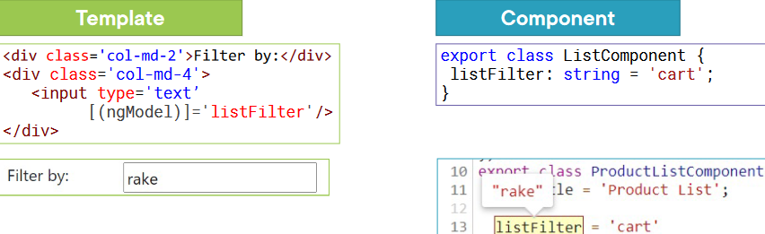

## Two-way Binding (banana)

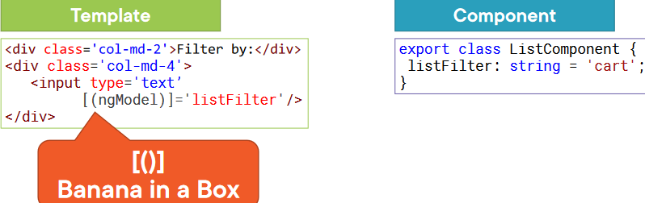

## Sсhema

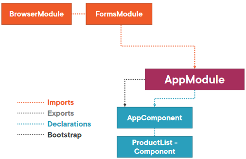

## Displaying Data with Binding

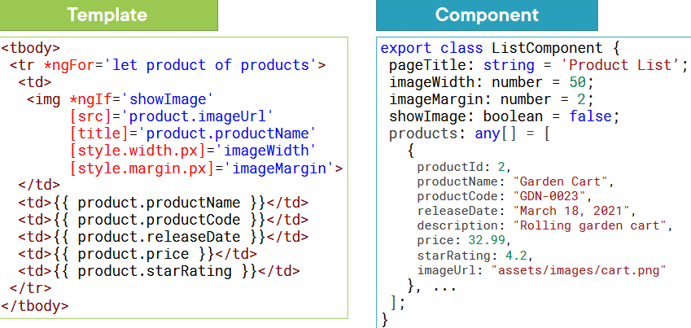

## Data Binding

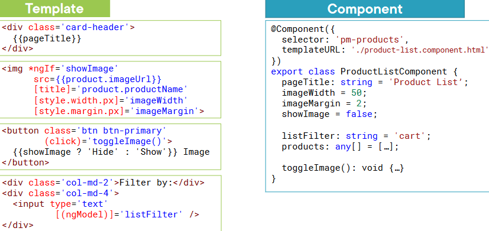

## Data Binding

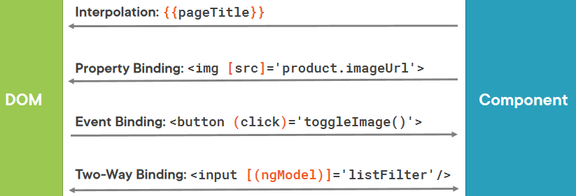

## Data Binding (ngModel)

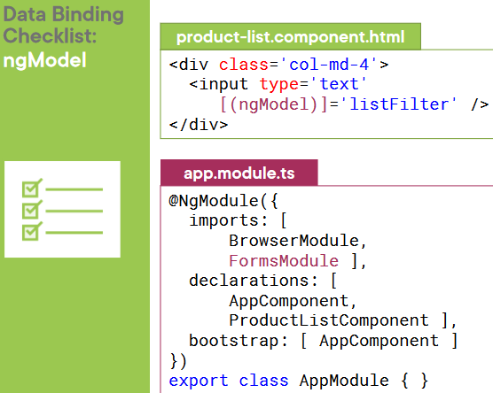

---

## Pipe Examples

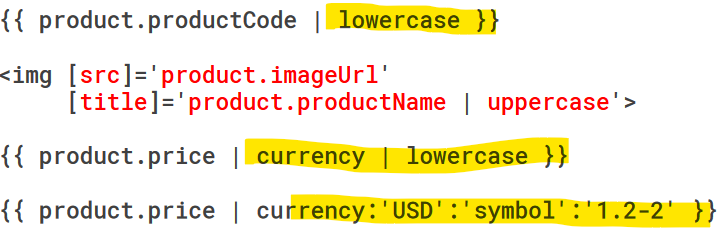
