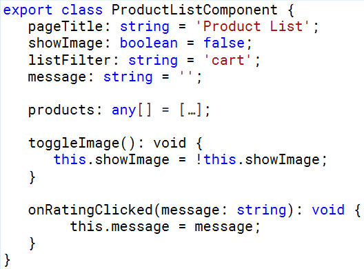
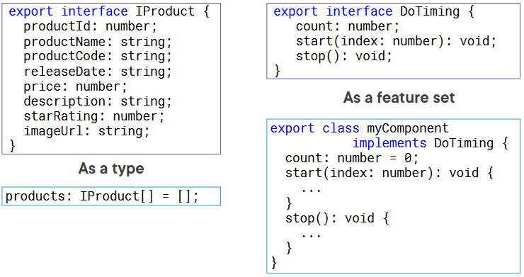
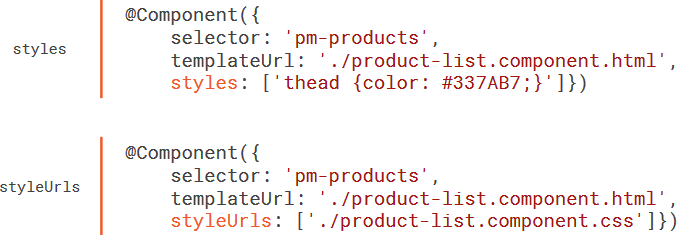
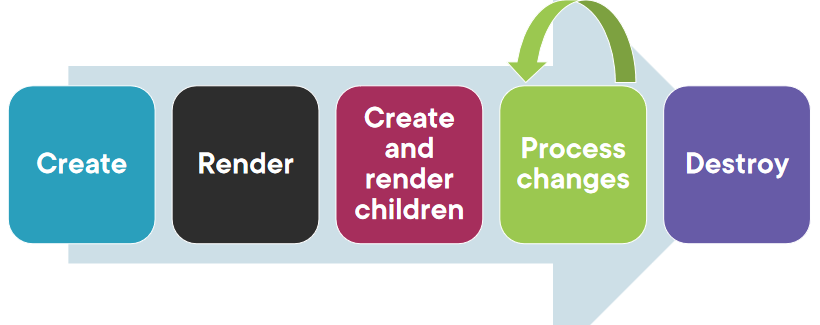
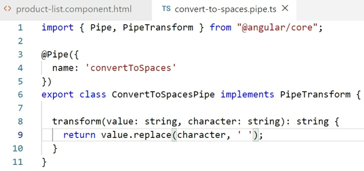
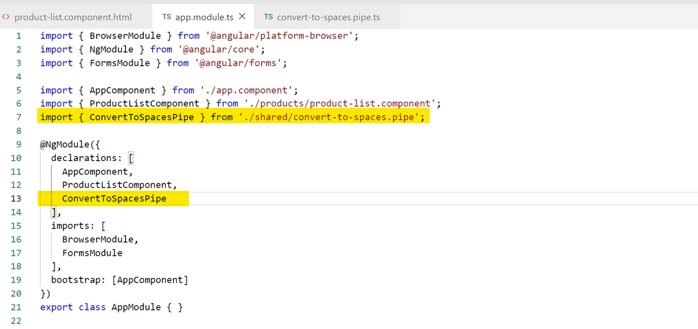
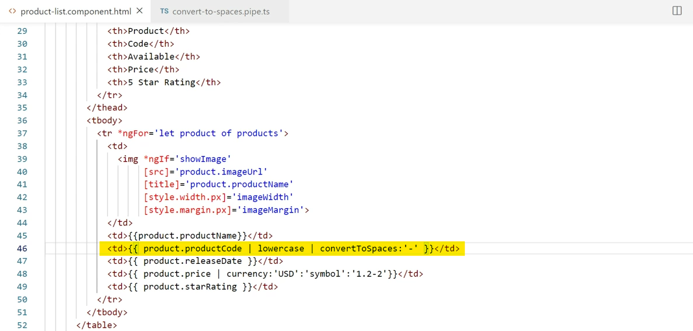
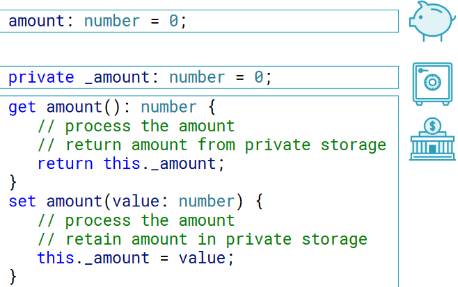
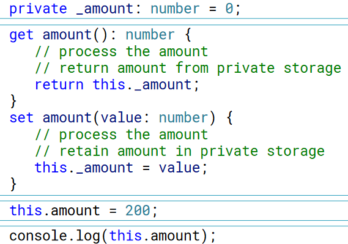

# angular basics в картинках

## Strong Typing

## Two Ways to Use an Interface

---

## Encapsulating Component Styles

## Component Lifecycle

## Building a Custom Pipe

## Building a Custom Pipe

## Building a Custom Pipe

---

## Getters and Setters

## Getters and Setters

