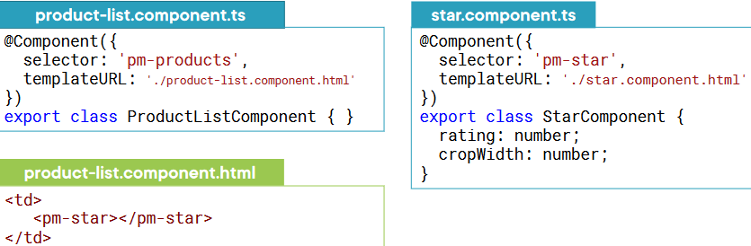
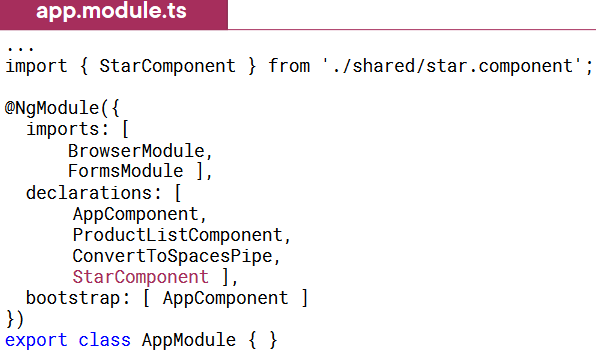
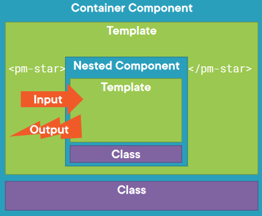
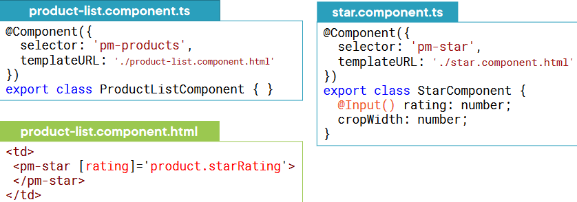
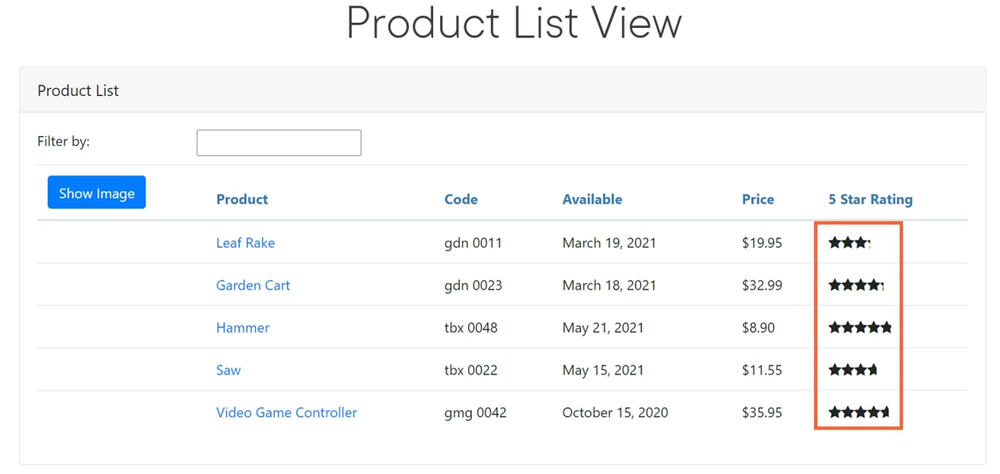
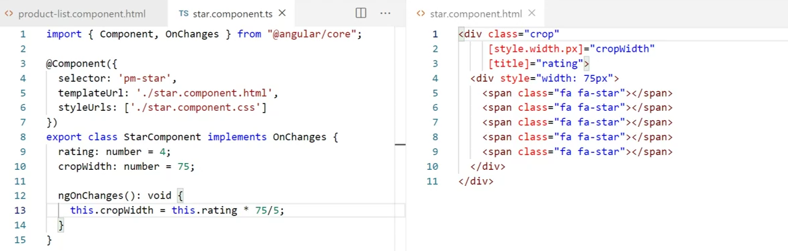
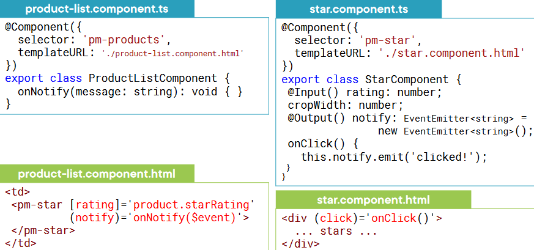
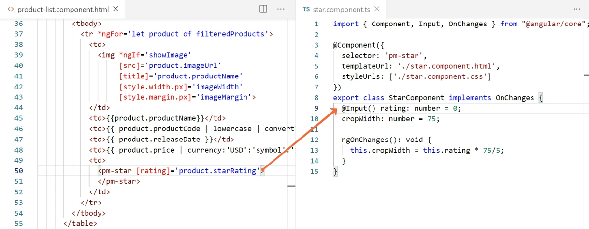
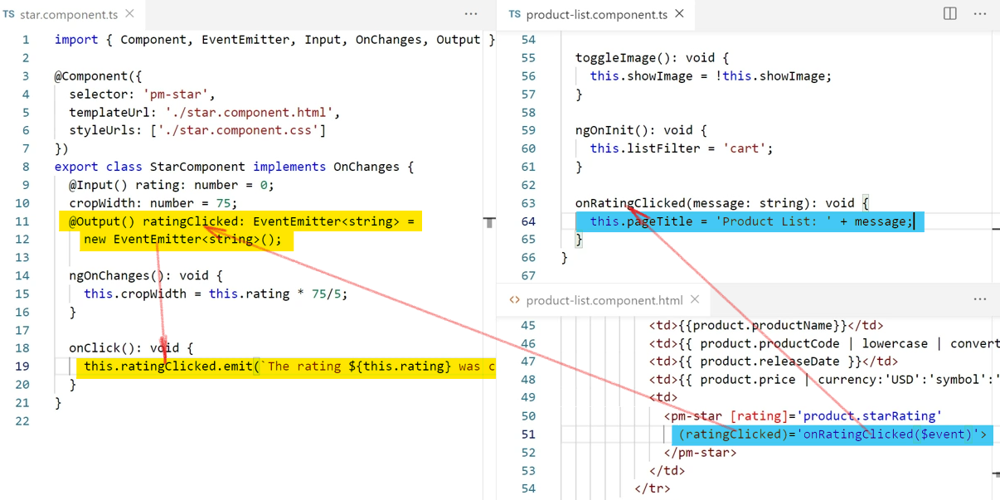
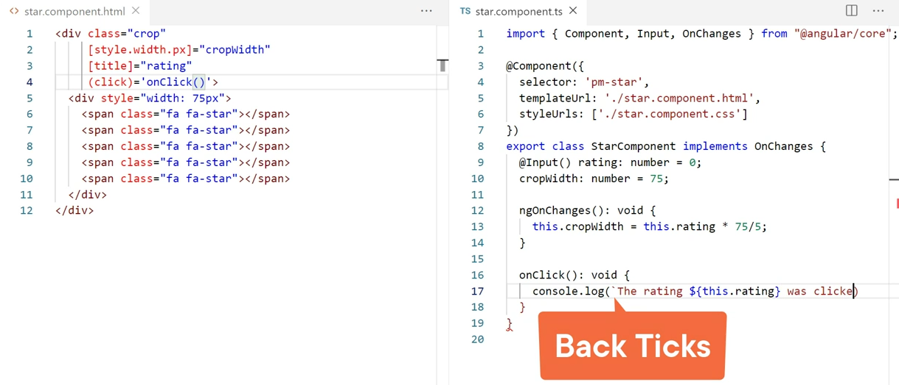

# angular basics в картинках

## Using a Nested Component as a Directive

## Declare Component

## Building a Nested Component

## Passing Data to a Nested Component (@Input)

## Passing Data to a Nested Component (@Input)

## Rating basic

## Emitting an Event (@Output)

## Rating: pass data to nested

## Rating basic handling

## Rating code

