# angular basics в картинках

## Mock Data

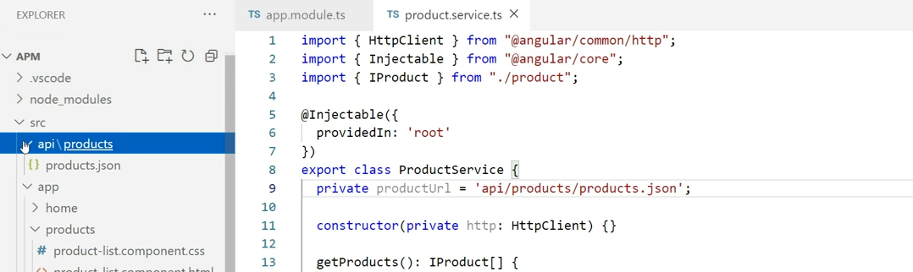

## Mock Data

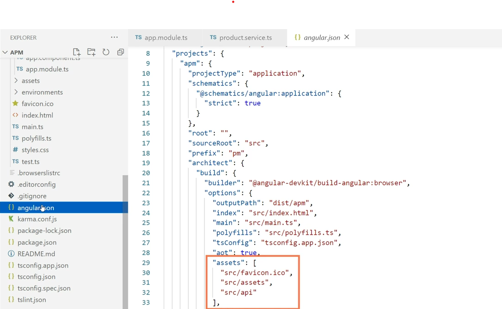

## Retrieving Data Using HTTP

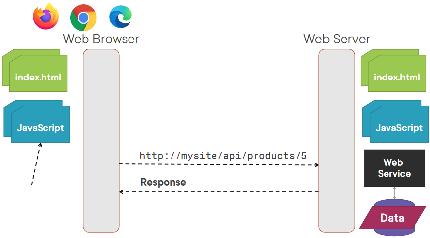

## Synchronous vs. Asynchronous

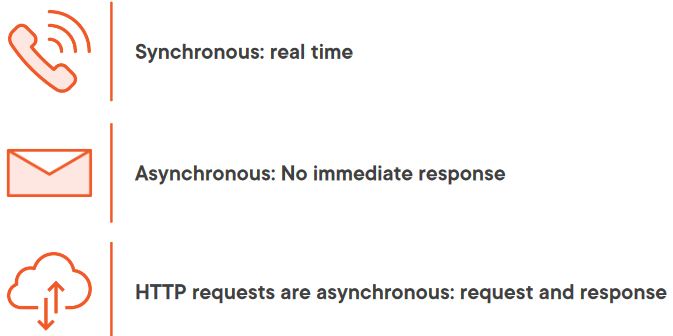

## What Does an Observable Do?

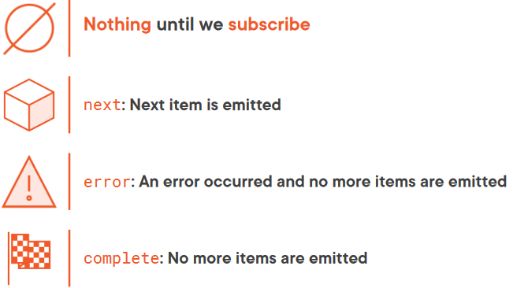

## Observable Pipe

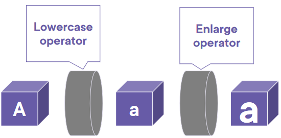

## Common Observable Usage

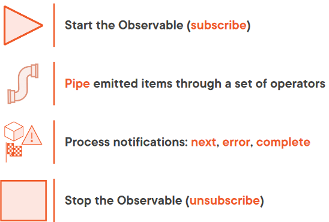

## Example

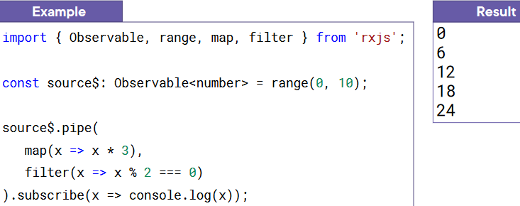

## Setting up an HTTP Request

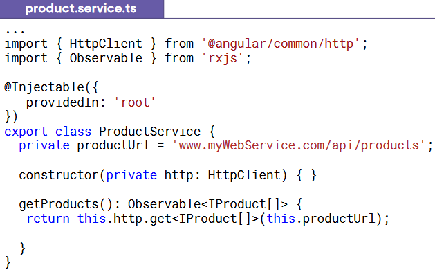

## Exception Handling

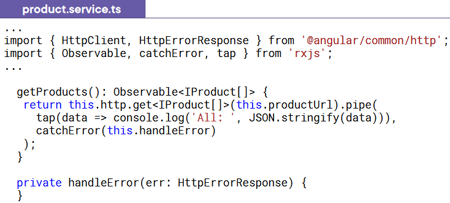

## Subscribing to an Observable

## Unsubscribing from an Observable

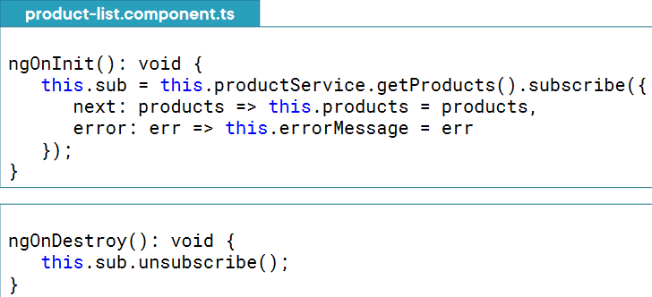
