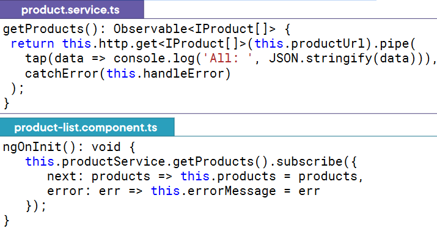

# angular basics в картинках

## Mock Data

## Mock Data

## Retrieving Data Using HTTP

## Synchronous vs. Asynchronous

## What Does an Observable Do?

## Observable Pipe

## Common Observable Usage

## Example

## Setting up an HTTP Request

## Exception Handling

## Subscribing to an Observable

## Unsubscribing from an Observable

