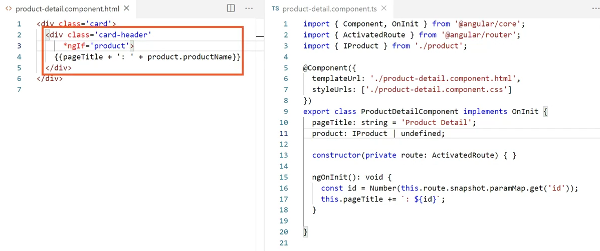
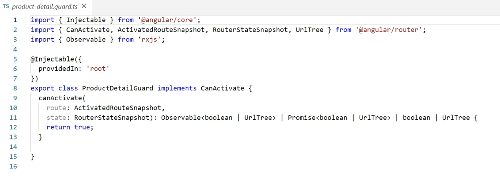

# angular basics в картинках

## Passing Parameters to a Route

## Passing Parameters to a Route

## Reading Parameters from a Route

## Reading Parameters from a Route

## Activating a Route with Code

## Protecting Routes with Guards

## Protecting Routes with Guards

## Building a Guard

## Using a Guard

---

## Prevent null or undefined errors

## Pass Params

## Activating a Route with Code

## Activating a Route with Code

## Activating a Route with Code

## Activating a Route with Code

## Activating a Route with Code

## Activating a Route with Code

## Activating a Route with Code

## Activating a Route with Code

## Activating a Route with Code

## Activating a Route with Code

