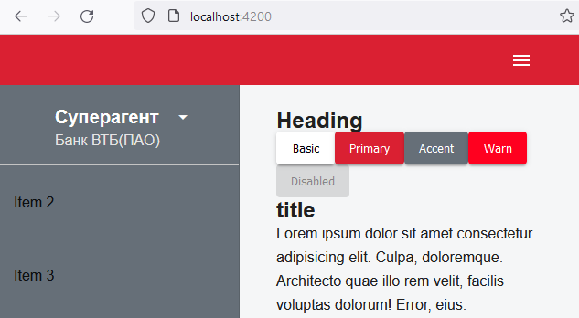
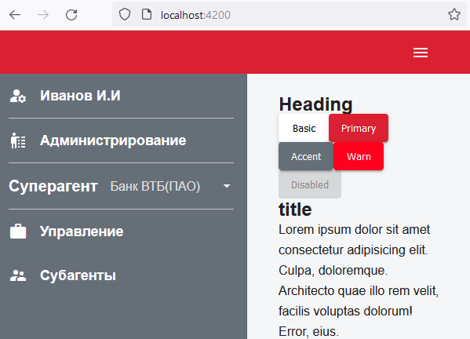

# r&m test project

- init

<details>

```js
git switch --orphan test6
New-Item .gitignore
New-Item README.md
mkdir test6
cd test6
ng new form --directory ./
// add material & custom theme
// custom palette (http://mcg.mbitson.com/#!?mcgpalette0=%23da2032)
ng add @angular/material

git commit --allow-empty -m "Initial"
git push -u origin test6

```



// add media-query ( BreakpointObserver.observe vs MediaMatcher )

<details>

```js
  /* MEDIA-QUERY-LIST
  matcher!: MediaQueryList;

  constructor(public mediaMatcher: MediaMatcher) {}

  ngOnInit() {
    this.matcher = this.mediaMatcher.matchMedia('(min-width: 960px)');
    this.matcher.addListener(this.myListener);
  }

  myListener(event: { matches: any }) {
    if (event.matches) {
      console.log('match');
    } else {
      console.log('no match');
    }
  }

  ngOnDestroy() {
    this.matcher.removeListener(this.myListener);
  }


//------ var ------

  mdq: MediaQueryList;
  mediaQueryListener: () => void;

constructor(changeDetectorRef: ChangeDetectorRef, media: MediaMatcher) {
  this.mdq = media.matchMedia('(max-width: 992px)');
  this.mediaQueryListener = () => {
    changeDetectorRef.detectChanges();
    console.log('Match?: ', this.mdq.matches);
  };
  this.mdq.addListener(this.mediaQueryListener);
  }

  */

  constructor(public breakpointObserver: BreakpointObserver) {}

  ngOnInit() {
    this.breakpointObserver
      .observe(['(max-width: 1024px)'])
      .subscribe((state: BreakpointState) => {
        state.matches
          ? (this.isSidenavOpen = false)
          : (this.isSidenavOpen = true);
      });
  }

```

</details>

</details>

- add custom icon service
- add sidenav & mobile menu

<details>

```js
ng g c components/sidenav --skip-tests --dry-run
```



</details>
