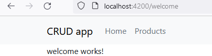

- init empty

<details>

```js
git switch --orphan test3
mkdir test5
New-Item .gitignore
New-Item README.md
cd test5
ng new ang-crud --directory ./
git commit --allow-empty -m "Init crud app"
git push -u origin test5
// add bootstrap/b.icons/basic comp/routing

npm i bootstrap bootstrap-icons
ng g c views/home/welcome --skip-tests --inline-style --flat --dry-run
ng g c views/error-page/page-not-found --inline-style --flat --skip-tests --inline-template --dry-run
```



</details>
