# test app

<details>
<summary>ep1</summary>

- init empty branch

```js
git switch --orphan <new branch>
git commit --allow-empty -m "Initial commit on orphan branch"
git push -u origin <new branch>

ng new test1
```

- bootstrap/icons

```js
cd test1

npm i bootstrap
npm i bootstrap-icons
```


</details>

<details>

<summary>ep2</summary>

- add ...

```js
// add component
ng g c views/products/product-list --skip-tests --dry-run

// add service
ng g s services/products --skip-tests --dry-run
```

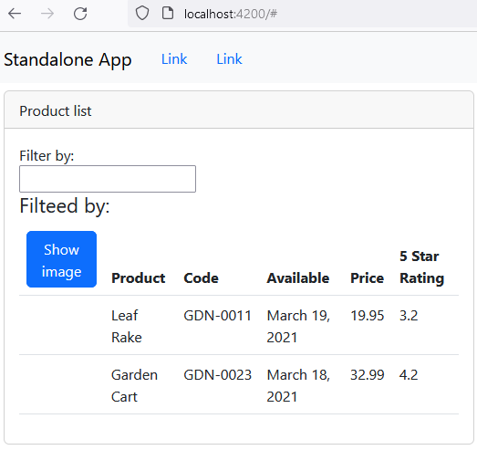

- property style binding

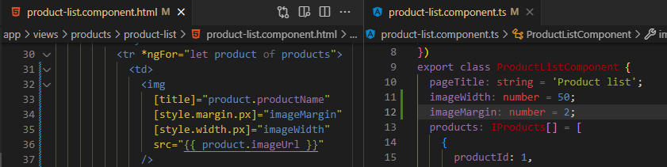

- change detection

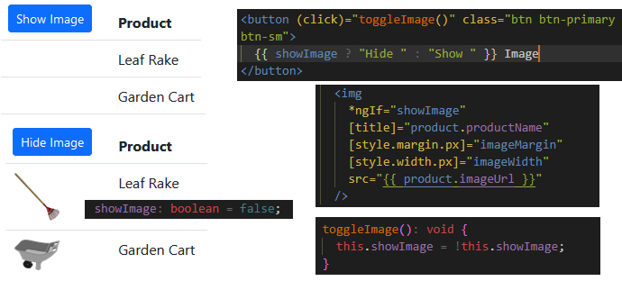

- two way binding

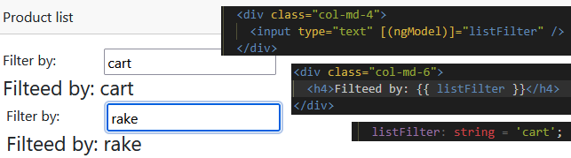

- add custom pipe

```js
ng g p shared/convert-to-space --skip-tests --dry-run

import { Pipe, PipeTransform } from '@angular/core';

@Pipe({
  name: 'convertToSpace',
})
export class ConvertToSpacePipe implements PipeTransform {
  transform(value: string, character: string): string {
    return value.replace(character, ' ');
  }
}
```

- init filter with getter & setter

```js
  private _listFilter: string = '';
  get listFilter() {
    return this._listFilter;
  }
  set listFilter(value: string) {
    this._listFilter = value;
  }
```

- add filter

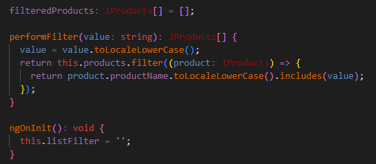

</details>

<details>

<summary>ep3</summary>

- [add rating component →](test1/src/app/shared/stars.component.ts)

```js
ng g c shared/stars --flat --skip-tests --inline-template --inline-style --dry-run
```

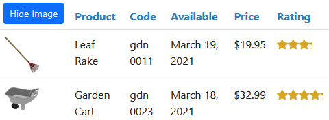

- Passing Data to a Nested Component (@Input)
- Emitting an Event (@Output)

</details>

<details>

<summary>ep4</summary>

- implement service
- retrieve data with http

```js
getProducts(): Observable<IProducts[]> {
  return this.http.get<IProducts[]>(this.productUrl).pipe(
    catchError(this.handleError)
  );
}

ngOnInit(): void {
this.sub = this.productService.getProducts().subscribe({
  next: (product) => {
    (this.products = product), (this.filteredProducts = this.products);
  },
  error: (err) => (this.errorMessage = err),
});
}

ngOnDestroy(): void {
this.sub.unsubscribe();
}
```

</details>

<details>

<summary>ep5</summary>

- add detail component

```js
ng g c views/products/product-detail --skip-tests --dry-run

/* this component is not nested, selector is don't need
   it's part os the routing */
import { Component, Input } from '@angular/core';

@Component({
 // selector: 'app-product-detail',
 //--------------------------------
  templateUrl: './product-detail.component.html',
  styleUrls: ['./product-detail.component.css'],
})
export class ProductDetailComponent {
  pageTitle: string = 'Product Detail';
}
```

</details>

<details>

<summary>ep6</summary>

- add routing

```js
ng generate module app-routing --flat --module=app --dry-run
```

// Routes Configuring !!!

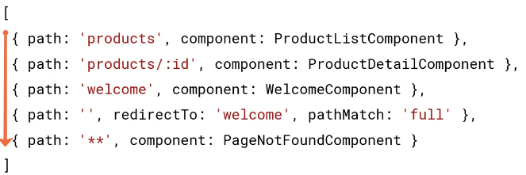

<details>

<summary>routing module</summary>

`app.module.ts`

```js
// ...
import { AppRoutingModule } from "./app-routing.module";

@NgModule({
  // ...
  imports: [AppRoutingModule],
  // ...
})
export class AppModule {}
```

`app-routing.module.ts`

```js
import { NgModule } from "@angular/core";
import { RouterModule, Routes } from "@angular/router";
import { ProductListComponent } from "./views/products/product-list/product-list.component";
import { ProductDetailComponent } from "./views/products/product-detail/product-detail.component";
import { WelcomeComponent } from "./views/home/welcome.component";

const routes: Routes = [
  { path: "products", component: ProductListComponent },
  { path: "products/:id", component: ProductDetailComponent },
  { path: "welcome", component: WelcomeComponent },
  { path: "", redirectTo: "welcome", pathMatch: "full" },
  { path: "**", redirectTo: "welcome", pathMatch: "full" },
];

@NgModule({
  declarations: [],
  imports: [RouterModule.forRoot(routes)],
  exports: [RouterModule],
})
export class AppRoutingModule {}
```

`app.component.html`

```js
<nav>
  <a routerLink="/welcome">Home</a>
  <a routerLink="/products">Product List</a>
</nav>
<div>
  <router-outlet></router-outlet>
</div>
```

</details>

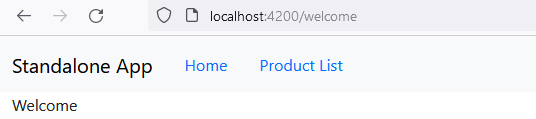

- add detail route with save navigation operator

- read params from route

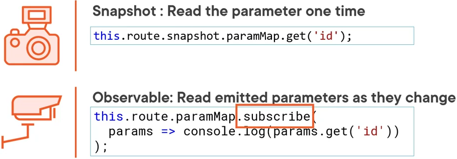

```html
<!-- SAVE NAVIGAION OPERATOR - ? 
  guard against null or undefined value 

  <div class="card-header">
    {{ pageTitle + ": " + product?.productName }}
  </div>

    OR we can use *ngIf 
-->
<div *ngIf="product" class="card-header">
  {{ pageTitle + ": " + product.productName }}
</div>

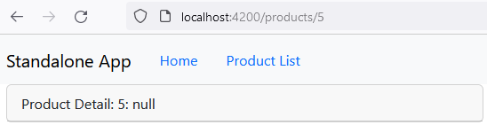
```

- add back btn

```js
import { Router } from '@angular/router';

  constructor(private router: Router) {}

  onBack() {
    this.router.navigate(['/products']);
  }
```

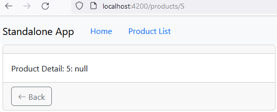

</details>

<details>

<summary>ep7</summary>

- protecting routes guards

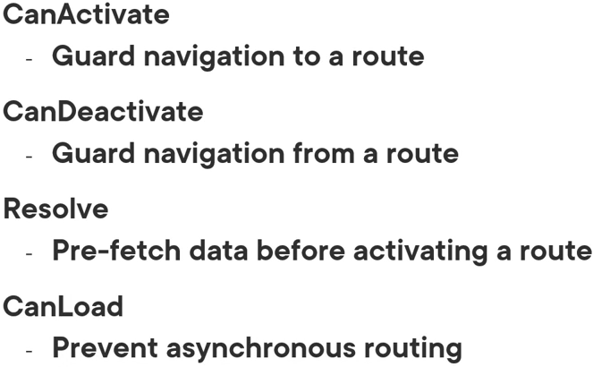

```js
// generate guard

ng g g views/products/product-detail/product-detail --skip-tests --dry-run

```

<details>

<summary>implement canactivate guard</summary>

```js
//app-routing.module.ts
import { ProductDetailGuard } from './views/products/product-detail/product-detail.guard';

const routes: Routes = [
  {
    path: 'products/:id',
    canActivate: [ProductDetailGuard],
    component: ProductDetailComponent,
  },
];
export class AppRoutingModule {}

// product-detail-guard.ts
import { Injectable } from '@angular/core';
import {
  ActivatedRouteSnapshot,
  Router,
  RouterStateSnapshot,
  UrlTree,
} from '@angular/router';
import { Observable } from 'rxjs';

@Injectable({
  providedIn: 'root',
})
export class ProductDetailGuard {
  constructor(private router: Router) {}

  canActivate(
    route: ActivatedRouteSnapshot,
    state: RouterStateSnapshot
  ):
    | Observable<boolean | UrlTree>
    | Promise<boolean | UrlTree>
    | boolean
    | UrlTree {
    const id = Number(route.paramMap.get('id'));
    if (isNaN(id) || id < 1) {
      alert('Invalid product id');
      this.router.navigate(['/products']);
    }
    return true;
  }
}

```

</details>

</details>
