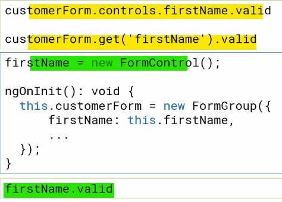

- init empty

<details>

```js
git switch --orphan test4
New-Item .gitignore
New-Item README.md
mkdir test4
cd test4
ng new form --directory ./
git commit --allow-empty -m "Initial"
git push -u origin test3

```

</details>

- template-driven vs reactive forms

<details>

- forms state
  
- form model
  
- template-driven forms
  
- reactive Forms
  
- directives
  
- directives TDF vs RFM
  
- basic HTML form
  
- basic template-driven forms
  
- basic reactive forms
  

</details>

- init app + template-driven form example

<details>

```js
// add components
ng g c views/home/welcome --flat --skip-tests --inline-style --dry-run
ng g c views/error-page/page-not-found --flat --skip-tests --inline-style --inline-template --dry-run
ng g c views/customers/customer --flat --skip-tests --inline-style --dry-run
// add routing
ng generate module app-routing --flat --module=app
```

### angular template-driven form example


</details>

- reactive form e.g.

<details>

- reactive forms
  
- create a formGroup
  

```js
// add component
ng g c views/clients/client --flat --skip-tests --inline-style --dry-run
```

- binding form model
  
- accessing form model properties
  

- setValue(require all fields)
  
- patchValue(accepts a piece of data)
  

---

- formBuilder
  
- formBuilder steps
  
- formBuilder formControl syntax
  

</details>

- validation (reactive way)

<details>

- overview
  
- create FormControls
  
- setting built-in validation rules
  
- runtime rules validation
  
- conditional validation (runtime)
  
- custom validation rules
  
- custom validation code
  

### basic validation


</details>
