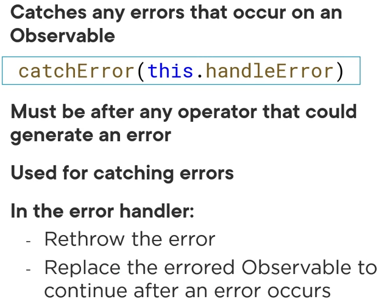
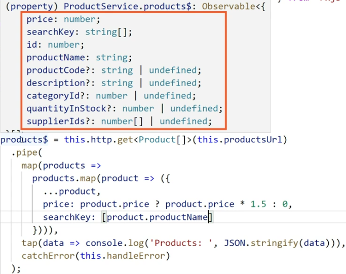
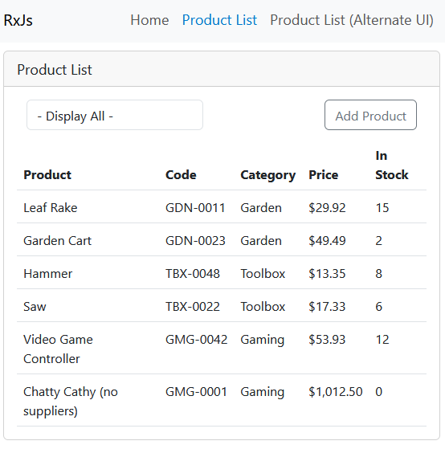
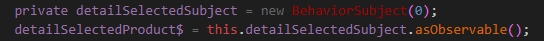
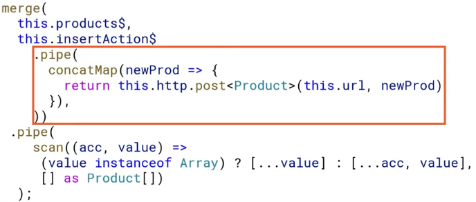
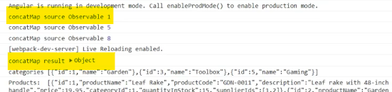
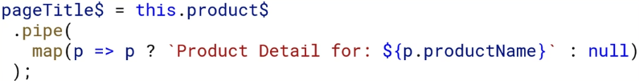

- Init Empty Branch

<details>

```js
git switch --orphan test3
git commit --allow-empty -m "Initial"
git push -u origin test3
New-Item .gitignore
New-Item README.md
mkdir test3
cd test3
ng new RxJs --directory ./

```

</details>

- Update Angular CLI Globaly

<details>

```js
npm uninstall -g angular-cli
npm cache clean or npm cache verify // (if npm > 5) ~clean -f
npm install -g @angular/cli@latest
```

</details>

- Lazy Loading route

<details>

```js
ng generate module login --route login --module app.module
// OR THE SAME
ng g m login --routing
// res → login/login-routing.module.ts & login/login.module.ts
ng g c login
// res → login/login.component/html/scss/spec.ts/ts

```

</details>

- Init App Structure

<details>

```js
ng g c views/home/welcome --flat --skip-tests --inline-style --dry-run
ng g s views/product-categories/product-category --skip-tests --dry-run
ng g i views/product-categories/product-category --dry-run
g g c views/products/product-list --flat --skip-tests
ng g i views/products/product --dry-run
ng g s views/products/product --skip-tests --dry-run
ng g m views/products/product --flat --dry-run
ng g c views/products/product-list-alt/product-detail --flat --skip-tests --inline-style --dry-run
ng g c views/products/product-list-alt/product-list-alt --flat --skip-tests --inline-style --dry-run
ng g c views/products/product-list-alt/product-shell --flat --skip-tests --inline-style --dry-run
ng g s suppliers/supplier --skip-tests --dry-run

npm i angular-in-memory-web-api

ng g c views/error-page/page-not-found --flat --skip-tests --inline-style --inline-template --dry-run

npm i bootstrap
```


</details>

---

## Data retrieval pattern

<details>

- procedural

<details>
// interface


// service


// error handle


// get data


// display data


</details>

- common pattern with an async pipe ("product$ | async")

<details>
// init stream$


// template with async pipe


</details>

- handling observable error

<details>
  - catch
  - optionally rethrow the error
  - replace the errored observable w a new observable

- RxJs Error Handling Features
  - catchError
    
    
  - throwError
    
  - EMPTY
    

---

- catch and replace


- catch and rethrow


// or


// regular


// reactive


// code


</details>

- async pipe benefits

<details>
  - no need to subscribe
  - no need to unsubscribe
  - improve change detection


- implement change detection


// with change detection


// without change detection


</details>

- procedural vs declarative

<details>
// procedural


// declarative


</details>

- parameters handling

<details>


</details>

- mapping an HTTP Response

<details>


- mapping array elements


// resolve syntax error (handle possibly undefined)


// another fup


// transforming array elements


// transforming data array!?



// transforming tada res


</details>

---

- types of combination operators/functions

<details>

// combine to a single Observable results (merge,concat)


// flatten high-order Observables


// emit a combined value (combineLatest, forkJoin withLatestFrom)


// combineLatest


// forkJoin (last not latest)


// withLatestFom


</details>

- mapping an Id to a string

<details>
// add string category


// ad second stream


// combining the streams


// combining the streams code


// res



</details>

- reacting to actions RxJs Features (filter,startWith, Subject, BehaviorSubject)

<details>
// filter


// filter diagram


// data stream vs action stream


// combining data stream and action stream


// Observable: Unicast


// Subject: Multicast


// BehaviorSubject


Creating an Action Stream


// reacting to action


// reacting to action


// start with initial value


// StartWith operator


// StartWith operator


// OR BehaviorSubject


</details>

## Reacting to actions (selections)

<details>

- create action stream
  
- combine ActionStream with DataStream
  
- emit value to the ActionStream
  
- ↓↓↓ // event emitter component.ts
  
- ↓↓↓ // event emitter component.html
  
- ↓↓↓ // event emitter component.html - !!! change styles w ActionStream
  
- bind Observable with ChangeDetectionStrategy.OnPush
- res:
  

</details>

- display error msg w action stream & changeDetectionStrategy

<details>

- init stream
  
- set value to stream
  
- bind observable w async pipe
  
- res: UI Error Display
  

</details>

## Managing State // merge, scan

<details>

- read only data
  
- incorporate a change in an Observable
  
- RxJs Opeator: scan
  
  // with initial state
  
  // array scan
  
- RxJs Opeator: merge
  
  // reacting to an Add Operation
  
  // reacting to an Add Operation
  
  // reacting to an Add Operation (POST)
  

</details>

## Caching Observables

<details>

- caching Observables
  
- classic caching pattern
  
- declarative caching pattern
  
- shareReply used for
  
- shareReply diagram
  
- share operator
  
- shareReply usage (caching data)
  
- shareReply usage (caching data)
  
- cache validation
  

</details>

## High-order Mapping Operators

<details>

- high-order mapping operators
  
- observable return observable (not recomended technic)
  
- RxJs Features (concatMap, mergeMap, switchMap)
  
- RxJs Features code
  
- RxJs Features res
  
- RxJs Features map nested subscription - bed practice
  
- concatMap !!! SEQUENCE/ORDER !!!
  
- concatMap Diagram
  
- concatMap code (without nested subscription!!!)
  
- concatMap res
  
- mergeMap !!! PARALLEL/WITHOUT ORDER !!!
  
- mergeMap Diagram
  
- mergeMap code
  
- mergeMap res
  
- switchMap
  
- switchMap Diagram
  
- switchMap code
  
- switchMap res
  

---

### mapping HOC Observable


// or

// hom res


</details>

## Combining the Streams

<details>

- define suppliers data obserbable stream
  
- combine datas
  
- supplier component
  
- related data stream
  
- related data stream (Just in Time)
  
- get related data stream just in time with forkJoin
  
- related data stream (Just in Time vs GET It All)
  
- own stream for title
  

</details>

</details>
