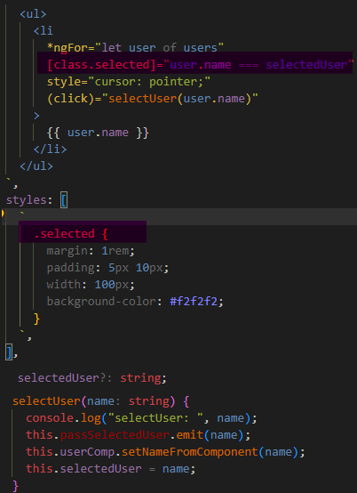

1. init:

![Alt text][def]

[def]: readmeAssets/init.png

---

2. Вывод переменных:

![Alt text][def2]

[def2]: readmeAssets/intropolation.png

---

3. Динамическое изменение свойств эл-та:

![Alt text][def3]

[def3]: readmeAssets/compDynamicProperty.png

---

4.  Обработка событий:

![Alt text][def4]

[def4]: readmeAssets/eventHandling.png

---

5.  Работа с элементами по ссылке:

![Alt text][def5]

[def5]: readmeAssets/workWithElemByRef.png

---

6. <a name="">transferDataToComponent</a> Передача данных в компонент, инпут декоратор:

![Alt text][def6]

[def6]: readmeAssets/transferDataToComponent.png

---

7.  Директивы *ngIf, *ngFor:

![Alt text][def7]

[def7]: readmeAssets/ngIf&ngForDirectives.png

---

8.  Вывод событий из компонетна:

![Alt text][def8]

[def8]: readmeAssets/outputEventsFromComp.png

---

9.  Подсветка выделенного компонента:

---

10.  Проекция контента с помощью ng-content:

![Alt text][def9]

[def9]: readmeAssets/contentProjection.png

---

11.  Атрибут директива: (изменяет св-ва эле-та: colory)

![Alt text][def10]

[def10]: readmeAssets/attributeDirective.png

---

12.  Структурная директива (\*, удаляет или добавляет эл-т в DOM, кастомная, Delay):

![Alt text][def11]

[def11]: readmeAssets/customDirective.png

---

13.  Экспорт контроллера директивы (Передача методов и данных в компонент):

![Alt text][def12]

[def12]: readmeAssets/directiveControllerExport.png
