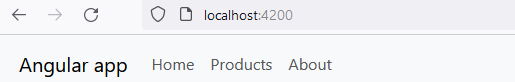
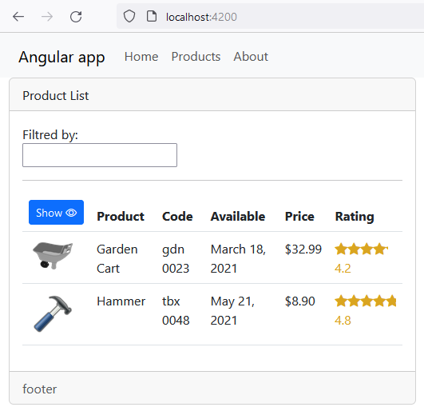

# Test2

This project was generated with [Angular CLI](https://github.com/angular/angular-cli) version 15.2.2.

## Development server

Run `ng serve` for a dev server. Navigate to `http://localhost:4200/`. The application will automatically reload if you change any of the source files.

## Code scaffolding

Run `ng generate component component-name` to generate a new component. You can also use `ng generate directive|pipe|service|class|guard|interface|enum|module`.

## Build

Run `ng build` to build the project. The build artifacts will be stored in the `dist/` directory.

## Running unit tests

Run `ng test` to execute the unit tests via [Karma](https://karma-runner.github.io).

## Running end-to-end tests

Run `ng e2e` to execute the end-to-end tests via a platform of your choice. To use this command, you need to first add a package that implements end-to-end testing capabilities.

## Further help

To get more help on the Angular CLI use `ng help` or go check out the [Angular CLI Overview and Command Reference](https://angular.io/cli) page.

---

- init app

```js
mkdir test2
cd test2
ng new test2 --directory ./  --minimal

npm i bootstrap bootstrap-icons
```



- add mock & models
- add service & component

```js
ng g i models/product --dry-run
ng g c views/products/product-list --dry-run
ng g s services/products --dry run
```

- display mock (conditionl render w icons) + [style.margin.px] binding


- add two way binding input

```js
// app.module.ts
import { FormsModule } from "@angular/forms";

@NgModule({
  imports: [BrowserModule, FormsModule],
})
export class AppModule {}

// component.html
<div class="col-md-4">
<input [(ngModel)]="listFilter" type="text" />
</div>

// component.ts
listFilter = 'cart'
```

- add custom pipe

```js
ng g p shared/convert-to-space --dry-run
```

- init filter logic (get|set)

```js
_listFilter = 'cart'
get listFilter() {
 return this._listFilter
}
set _listFilter(value: string) {
    this._listFilter = value
}
```

- implement input filter

```js
filtredProducts: IProduct[]=[]


set _listFilter(value: string) {
    this._listFilter = value
    this.filteredProducts = this.FilteredData(velue)
}

  ngOnInit(): void {
    this.listFilter = "";
  }

filteredData(val){
  return this.products.filter(el=>el.productName.toLowerCase().includes(va.toLowerCase()))
}
```

- add star-rating [component](src/app/shared/stars-rating.component.ts)

```js
ng g c shared/stars-rating --falt
```


