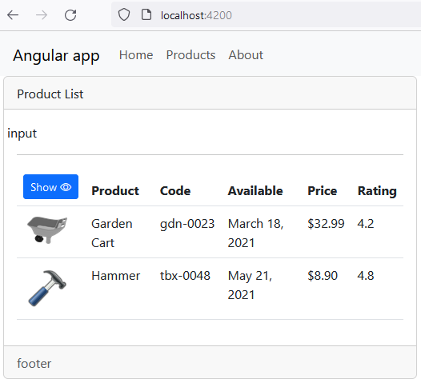

# Test2

This project was generated with [Angular CLI](https://github.com/angular/angular-cli) version 15.2.2.

## Development server

Run `ng serve` for a dev server. Navigate to `http://localhost:4200/`. The application will automatically reload if you change any of the source files.

## Code scaffolding

Run `ng generate component component-name` to generate a new component. You can also use `ng generate directive|pipe|service|class|guard|interface|enum|module`.

## Build

Run `ng build` to build the project. The build artifacts will be stored in the `dist/` directory.

## Running unit tests

Run `ng test` to execute the unit tests via [Karma](https://karma-runner.github.io).

## Running end-to-end tests

Run `ng e2e` to execute the end-to-end tests via a platform of your choice. To use this command, you need to first add a package that implements end-to-end testing capabilities.

## Further help

To get more help on the Angular CLI use `ng help` or go check out the [Angular CLI Overview and Command Reference](https://angular.io/cli) page.

---

- init app

<details>

<summary>code</summary>

```js
mkdir test2
cd test2
ng new test2 --directory ./  --minimal

npm i bootstrap bootstrap-icons
```


- add mock & models
- add service & component

```js
ng g i models/product --dry-run
ng g c views/products/product-list --dry-run
ng g s services/products --dry run
```

- display mock (conditionl render w icons) + [style.margin.px] binding



</details>

- add two way binding input

<details>

<summary>code</summary>

```js
// app.module.ts
import { FormsModule } from "@angular/forms";

@NgModule({
  imports: [BrowserModule, FormsModule],
})
export class AppModule {}

// component.html
<div class="col-md-4">
<input [(ngModel)]="listFilter" type="text" />
</div>

// component.ts
listFilter = 'cart'
```

- add custom pipe

```js
ng g p shared/convert-to-space --dry-run
```

- init filter logic (get|set)

```js
_listFilter = 'cart'
get listFilter() {
 return this._listFilter
}
set _listFilter(value: string) {
    this._listFilter = value
}
```

</details>

- implement input filter

<details>

<summary>code</summary>

```js
filtredProducts: IProduct[]=[]


set _listFilter(value: string) {
    this._listFilter = value
    this.filteredProducts = this.FilteredData(velue)
}

  ngOnInit(): void {
    this.listFilter = "";
  }

filteredData(val){
  return this.products.filter(el=>el.productName.toLowerCase().includes(va.toLowerCase()))
}
```

- add star-rating [component](src/app/shared/stars-rating.component.ts)

```js
ng g c shared/stars-rating --falt
```


- send data w @output

```js
// eventDonor.html
(click)="clickHandle(value)"

// eventDonor.ts
@Output()donorComponentEvent = new EventEmitter()

clickHandle(val){
  this.donorComponentEvent.emit(val)
}

// eventAcceptor.html
<plug-in-component (donorComponentEvent)="eventHandler($event)" ></plug-in-component>

// eventAcceptor.ts

eventHandler(val){
  // ... ${val}
}
```

- implement sevice
- add detail & welcom components

```js
ng g c views/products/product-detail --dry-run
ng g c views/home/welcome --flat --dry-run
```

</details>

- add routing

<details>
<summary>code</summary>

```js
ng generate module app-routing --flat --module=app

// app.module.ts
import { AppRoutingModule } from './app-routing.module';

@NgModule({
  declarations: [
// ...
  ],
  imports: [ AppRoutingModule],

})
export class AppModule {}

// src/app/app-routing.module.ts
import { NgModule } from "@angular/core";
import { CommonModule } from "@angular/common";
import { RouterModule, Routes } from "@angular/router";
import { ProductListComponent } from "./views/products/product-list/product-list.component";
import { ProductDetailComponent } from "./views/products/product-detail/product-detail.component";
import { WelcomeComponent } from "./views/home/welcome.component";
import { AboutComponent } from "./views/about/about.component";

const routes: Routes = [
  { path: "products", component: ProductListComponent },
  { path: "products/:id", component: ProductDetailComponent },
  { path: "welcome", component: WelcomeComponent },
  { path: "about", component: AboutComponent },
  { path: "", redirectTo: "welcome", pathMatch: "full" },
  { path: "**", redirectTo: "welcome", pathMatch: "full" },
];

@NgModule({
  declarations: [],
  imports: [CommonModule, RouterModule.forRoot(routes)],
  exports: [RouterModule],
})
export class AppRoutingModule {}

// app.component.html
<a class="nav-link" routerLink="/welcome" routerLinkActive="active">Home</a>
// app.component.html
.nav-link.active {background-color: #f3f3f3}
```


</details>

<details>

<summary>code</summary>

[CanActivate guard](src/app/views/products/product-detail/product-detail.guard.ts)

```js
// CanActivate guard
ng g g views/products/product-detail/product-detail --dry-run

//app-routing.module.ts
import { ProductDetailGuard } from './views/products/product-detail/product-detail.guard';

const routes: Routes = [
  {
    path: 'products/:id',
    canActivate: [ProductDetailGuard],
    component: ProductDetailComponent,
  },
];
export class AppRoutingModule {}

// product-detail-guard.ts
import { Injectable } from '@angular/core';
import {
  ActivatedRouteSnapshot,
  Router,
  RouterStateSnapshot,
  UrlTree,
} from '@angular/router';
import { Observable } from 'rxjs';

@Injectable({
  providedIn: 'root',
})
export class ProductDetailGuard {
  constructor(private router: Router) {}

  canActivate(
    route: ActivatedRouteSnapshot,
    state: RouterStateSnapshot
  ):
    | Observable<boolean | UrlTree>
    | Promise<boolean | UrlTree>
    | boolean
    | UrlTree {
    const id = Number(route.paramMap.get('id'));
    if (isNaN(id) || id < 1) {
      alert('Invalid product id');
      this.router.navigate(['/products']);
    }
    return true;
  }
}
```

</details>
